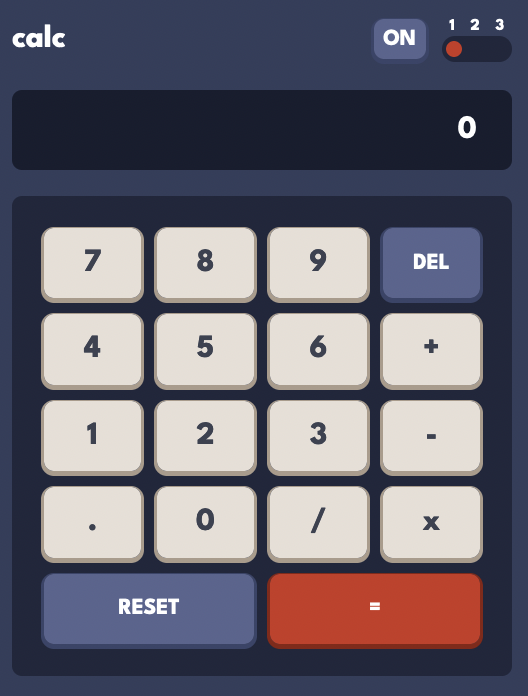

# Frontend Mentor - Calculator app solution

This is a solution to the
[Calculator app challenge on Frontend Mentor](https://www.frontendmentor.io/challenges/calculator-app-9lteq5N29).
Frontend Mentor challenges help you improve your coding skills by building realistic projects.

## Table of contents

- [Frontend Mentor - Calculator app solution](#frontend-mentor---calculator-app-solution)
  - [Table of contents](#table-of-contents)
  - [Overview](#overview)
    - [The challenge](#the-challenge)
    - [Extra features added](#extra-features-added)
    - [Screenshot](#screenshot)
    - [Links](#links)
  - [My process](#my-process)
    - [This project has been built with](#this-project-has-been-built-with)
    - [What I learned](#what-i-learned)
  - [Author](#author)

## Overview

### The challenge

Users should be able to:

&#9745; See the size of the elements adjust based on their device's screen size

&#9745; Perform mathmatical operations like addition, subtraction, multiplication, and division

&#9745; Adjust the color theme based on their preference

&#9745; Have their initial theme preference checked using `prefers-color-scheme` and have any
additional changes saved in the browser

### Extra features added

&#9745; Smoother transitions between themes by use of a full-screen overlay.

&#9745; The addition of an on-off button.

&#9745; On-off behaviour is stored in browser storage.

&#9745; Accepts keyboard input.

### Screenshot

### Links

-   Live Site URL: [Netlify](https://jakegodsall-calculator.netlify.app/)

## My process

### This project has been built with

-   Semantic HTML5 markup
-   CSS custom properties
-   Flexbox, CSS Grid
-   BEM
-   SCSS, 7-1 Architecture
-   Mobile-first workflow
-   Vanilla JS, ES6 Classes

### What I learned

1. This is the first project I have worked on for which I have utilised ES6 classes. Initially, I
   went for a more functional approach but it soon became apparent that it would be much easier to
   encapsulate all the behaviour within a Calculator class.
2. Formatting numbers with the Internationalization API, `Intl`.
3. The value of having separation of concerns regarding logic and rendering to the DOM.
4. To use naming conventions for custom properties in CSS to avoid creating distinct styles for
   themes.

## Author

-   Website - [Jake Godsall](https://jakegodsall.com)
-   Frontend Mentor - [@jakegodsall](https://www.frontendmentor.io/profile/jakegodsall)
-   Linkedin - [@godsalljake](https://www.linkedin.com/in/godsalljake/)
